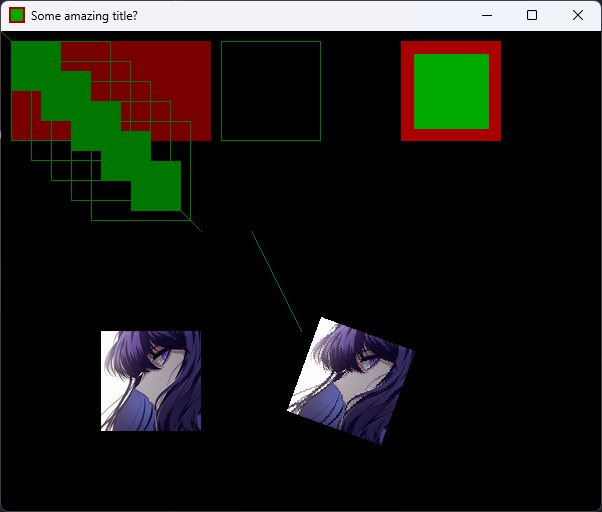

# SDL2 in dart

I had so much fun coding in C++ on my degree using SDL2. 
Today im in love with the dart language so, why shouldn't I write my SDL2 code in dart and make it execute under the hood using ffi?

## Why?

Im having so much funny writing this "lib" in order to call C++ functions using ffi from dart code. 
This is all **super experimental** and most SDL2 functions are still to be written, so don't expect it to work as it is.

Im also trying to make it seamless so the user does not have to work directly with pointers.

## Example

Here is an image of a window rendered using the SDL2 lib from dart code. 
The code can be found in this [file](bin/sdl2.dart): 

